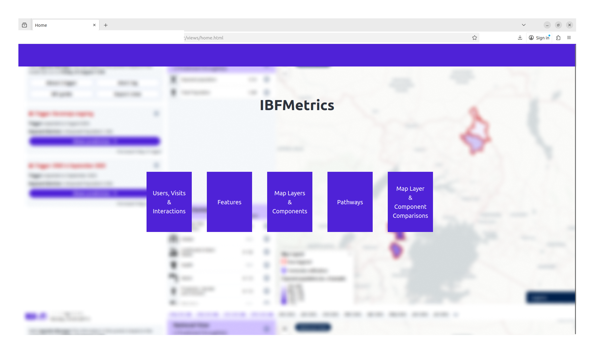
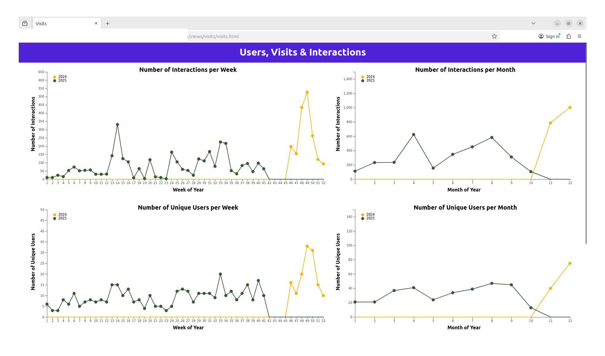

<h1>Extracting Insights from IBF Usage</h1>

   This repository contains a web application being built to analyse and visualise analytics data collected from the <a href="https://510.global/product/ibf/">Impact Based Forecasting</a> portal developed by <a href="https://github.com/rodekruis">The Netherlands Red Cross' 510</a>. From the visualisations, insights about the usage of the portal will be extracted to support ongoing and future <a href="https://github.com/rodekruis/IBF-system">development</a> of IBF.

<h3>Structure</h3>

   Components of this project are:
   <ul>
	<li>API</li>
	<li>Dashboard</li>
   </ul>

<h4>Dashboard</h4>

The front-end currently consists of 2 views.

<ol>
    <li>
	
Home Page

	
    </li>
    <li>
	
Users, Visits and Interactions

	
    </li>
</ol>

<h3>Acknowledgements</h3>
<a href="https://github.com/gulfaraz">Gulfaraz Rahman</a>
